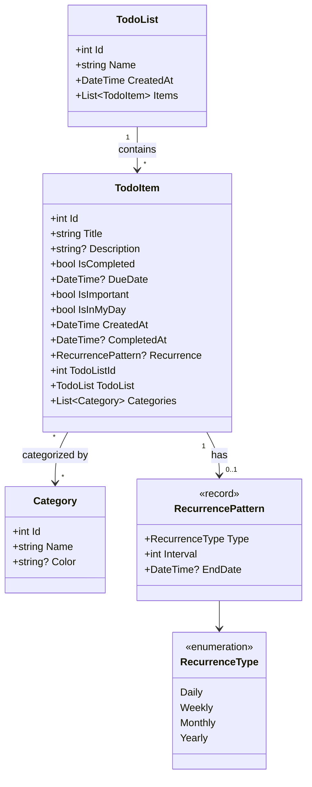
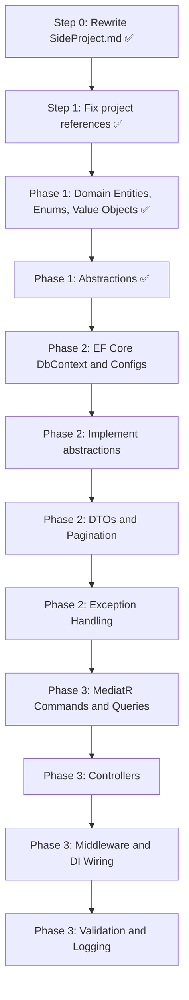

# TodoList Backend - Implementation Plan

## Current State

The solution (`TodoList.slnx`) targets .NET 10 and contains four projects:

- `**src/TodoList.Domain**` - Domain entities (TodoItem, TodoList, Category), value objects (RecurrencePattern), enums (RecurrenceType), and abstractions — all implemented as simple POCOs with `int` IDs
- `**src/TodoList.Infrastructure**` - empty `Class1.cs`, references Domain
- `**src/TodoList.Api**` - default WeatherForecast controller
- `**tests/Test.Api**` - commented-out Aspire integration test

### Design Decisions

- **Simple POCO models** — entities have no constructors, no business methods, and no inline validation. They are plain data containers.
- `**int` primary keys** — auto-incremented by the database, keeping things simple and conventional.
- **Validation at the service layer** — input validation will be handled by FluentValidation or manual checks in MediatR command handlers (Phase 3), not inside entities.
- `**record` for value objects** — `RecurrencePattern` is a C# record for built-in equality semantics.

---

## Step 0: Rewrite SideProject.md

Transform `[SideProject.md](SideProject.md)` into a professional, impersonal project proposal document that:

- Removes all personal references ("Rasoul", "we", "he", "his")
- Structures the document as a formal project proposal with: Objective, Scope, Features, Architecture, Phases, Learning Outcomes, and Deliverables
- Makes it AI-friendly so it can serve as context for AI-assisted implementation
- Preserves all original feature requirements and learning expectations
- Adds a domain model overview (entities, relationships) for clarity

---

## Step 1: Fix Project References

Fix the duplicate project reference in `[src/TodoList.Api/TodoList.Api.csproj](src/TodoList.Api/TodoList.Api.csproj)`:

```xml
<!-- Remove this incorrect duplicate -->
<ProjectReference Include="..\src\TodoList.Domain\TodoList.Domain.csproj" />
```

Keep only the correct reference: `..\TodoList.Domain\TodoList.Domain.csproj`

---

## Phase 1: Domain Layer

**Project:** `[src/TodoList.Domain](src/TodoList.Domain)`

### Domain Model




All entities are simple POCOs with public getters/setters, `int` IDs, and no constructors or business methods. Validation is deferred to the service/handler layer.

### Implementation Tasks (completed)

- Delete old entity files (`Class1.cs`, `TodoTask.cs`, `RepeatedTask.cs`, `TaskCategory.cs`, `RepeatedTaskTypeEnum.cs`)
- Create folder structure: `Entities/`, `ValueObjects/`, `Enums/`, `Abstractions/`
- **Enums:** `RecurrenceType` (Daily, Weekly, Monthly, Yearly)
- **Value Objects:** `RecurrencePattern` (Type, Interval, EndDate) as a C# `record`
- **Entities (simple POCOs, no constructors, no validation):**
  - `Category` — Id, Name, Color
  - `TodoItem` — Id, Title, Description, IsCompleted, DueDate, IsImportant, IsInMyDay, CreatedAt, CompletedAt, Recurrence, TodoListId, TodoList (navigation), Categories
  - `TodoList` — Id, Name, CreatedAt, Items
- **Abstractions:** `ITodoItemAbstraction`, `ITodoListAbstraction`, `ICategoryAbstraction` in `Abstractions/` folder (`ITodoItemAbstraction.cs`, `ITodoListAbstraction.cs`, `ICategoryAbstraction.cs`)

### Unit Tests

Since entities are simple POCOs with no business logic, unit tests for the domain layer are minimal. Testing focus shifts to:

- Phase 2: repository integration tests
- Phase 3: command handler validation tests, API integration tests

### Learning Outcomes

- Class, record, and interface definitions in C#
- POCO-style entity modeling
- Navigation properties and EF Core relationship conventions
- Abstractions (data-access contracts in Domain, implementations in Infrastructure)
- Difference between `class` and `record` in C#
- Nullable reference types (`string?`, `DateTime?`)

---

## Phase 2: Infrastructure Layer

**Project:** `[src/TodoList.Infrastructure](src/TodoList.Infrastructure)`

### Implementation Tasks

- Delete `Class1.cs`
- **Add NuGet packages:** `Microsoft.EntityFrameworkCore.SqlServer` (or `.Sqlite` for local dev), `Microsoft.EntityFrameworkCore.Design`
- **DbContext:** Create `TodoListDbContext` with `DbSet<TodoItem>`, `DbSet<TodoList>`, `DbSet<Category>`
- **Entity Configurations:** Fluent API configurations in `Configurations/` folder (table names, indexes, relationships, value object mapping for RecurrencePattern as owned type)
- **Repository implementations:** Implement `TodoItemRepository`, `TodoListRepository`, `CategoryRepository` (concrete classes that implement `ITodoItemAbstraction`, `ITodoListAbstraction`, `ICategoryAbstraction`) using EF Core
- **DTOs:** Create response/request DTOs in a `Dtos/` folder for each entity (separation from domain entities)
- **Pagination:** Implement a generic `PaginatedResult<T>` and `IQueryable` extension methods for pagination
- **Exception Handling:** Create domain-specific exceptions (`NotFoundException`, `ValidationException`)
- **CQRS preparation:** Define `ICommand`, `IQuery<TResult>` interfaces to prepare for the Mediator pattern in Phase 3
- **Migrations:** Generate initial EF Core migration

### Learning Outcomes

- EF Core: DbContext, Fluent API, migrations, query creation
- `IQueryable` vs `IEnumerable` (deferred execution)
- Implementing the data-access abstractions
- DTO projection (avoiding entity exposure)
- Pagination patterns
- Exception handling strategies

---

## Phase 3: Presenter / API Layer

**Project:** `[src/TodoList.Api](src/TodoList.Api)`

### Implementation Tasks

- Remove `WeatherForecastController.cs` and `WeatherForecast.cs`
- **Add NuGet packages:** `MediatR` for mediator pattern
- **Fix `Program.cs`:** Register DbContext, repositories, MediatR, configure middleware pipeline
- **MediatR Handlers:**
  - Commands: `CreateTodoItemCommand`, `UpdateTodoItemCommand`, `DeleteTodoItemCommand`, `CompleteTodoItemCommand`, `CreateTodoListCommand`, `CreateCategoryCommand`
  - Queries: `GetTodoItemsQuery` (with filters for MyDay, Planned, Important), `GetTodoListsQuery`, `GetCategoriesQuery`
- **Controllers (or Minimal API endpoints):**
  - `TodoItemsController` - CRUD + complete/uncomplete + My Day toggle + filter endpoints
  - `TodoListsController` - CRUD + list items
  - `CategoriesController` - CRUD
- **Middleware:** Global exception handling middleware that maps domain exceptions to HTTP status codes
- **Dependency Injection:** Wire up all services in `Program.cs` using extension methods in an `Extensions/` folder
- **Validation:** FluentValidation or manual validation on commands — this is where all entity validation lives (not in the domain models)
- **Logging:** Structured logging with `ILogger<T>` throughout

### API Endpoints Overview

- `GET /api/todoitems?filter=myday|planned|important` - filtered task list
- `GET /api/todoitems/{id}` - single task
- `POST /api/todoitems` - create task
- `PUT /api/todoitems/{id}` - update task
- `DELETE /api/todoitems/{id}` - delete task
- `POST /api/todoitems/{id}/complete` - mark complete
- `POST /api/todoitems/{id}/myday` - toggle My Day
- `GET /api/todolists` - all lists
- `POST /api/todolists` - create list
- `GET /api/todolists/{id}/items` - items in a list
- `GET /api/categories` - all categories
- `POST /api/categories` - create category

### Learning Outcomes

- Controllers and routing in ASP.NET Core
- Dependency injection and service lifetimes
- Middleware pipeline
- Mediator pattern (CQRS with MediatR)
- Request validation
- Structured logging

---

## Suggested Implementation Order




Each phase concludes with a review checkpoint before moving to the next phase.